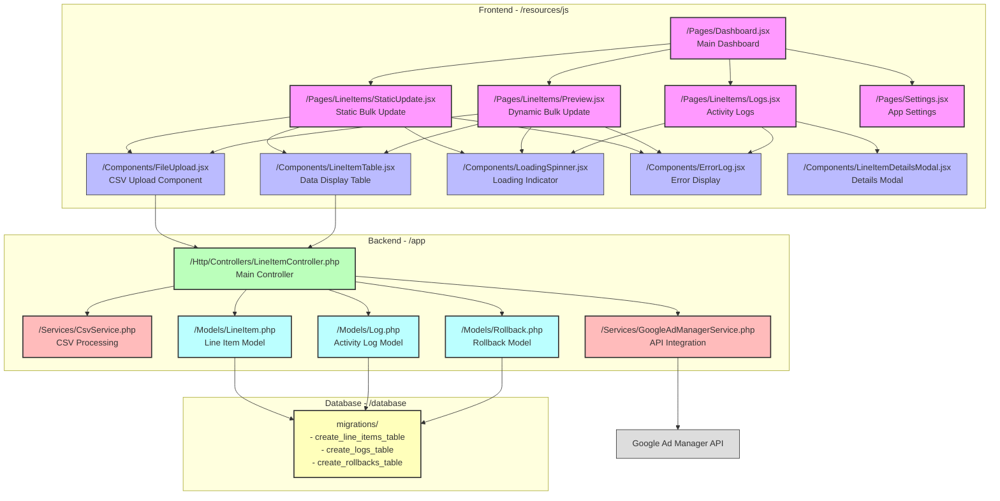

```mermaid
graph TD
    %% Frontend Components
    subgraph Frontend [Frontend - /resources/js]
        %% Pages
        Dashboard["/Pages/Dashboard.jsx<br/>Main Dashboard"]
        StaticUpdate["/Pages/LineItems/StaticUpdate.jsx<br/>Static Bulk Update"]
        DynamicUpdate["/Pages/LineItems/Preview.jsx<br/>Dynamic Bulk Update"]
        Logs["/Pages/LineItems/Logs.jsx<br/>Activity Logs"]
        Settings["/Pages/Settings.jsx<br/>App Settings"]

        %% Components
        FileUpload["/Components/FileUpload.jsx<br/>CSV Upload Component"]
        LineItemTable["/Components/LineItemTable.jsx<br/>Data Display Table"]
        LoadingSpinner["/Components/LoadingSpinner.jsx<br/>Loading Indicator"]
        ErrorLog["/Components/ErrorLog.jsx<br/>Error Display"]
        LineItemDetailsModal["/Components/LineItemDetailsModal.jsx<br/>Details Modal"]
    end

    %% Backend Components
    subgraph Backend [Backend - /app]
        %% Controllers
        LineItemController["/Http/Controllers/LineItemController.php<br/>Main Controller"]

        %% Services
        CsvService["/Services/CsvService.php<br/>CSV Processing"]
        GAMService["/Services/GoogleAdManagerService.php<br/>API Integration"]

        %% Models
        LineItemModel["/Models/LineItem.php<br/>Line Item Model"]
        LogModel["/Models/Log.php<br/>Activity Log Model"]
        RollbackModel["/Models/Rollback.php<br/>Rollback Model"]
    end

    %% Database
    subgraph Database [Database - /database]
        Migrations["migrations/<br/>- create_line_items_table<br/>- create_logs_table<br/>- create_rollbacks_table"]
    end

    %% Flow Connections
    Dashboard --> StaticUpdate
    Dashboard --> DynamicUpdate
    Dashboard --> Logs
    Dashboard --> Settings

    StaticUpdate --> FileUpload
    StaticUpdate --> LineItemTable
    StaticUpdate --> LoadingSpinner
    StaticUpdate --> ErrorLog

    DynamicUpdate --> FileUpload
    DynamicUpdate --> LineItemTable
    DynamicUpdate --> LoadingSpinner
    DynamicUpdate --> ErrorLog

    Logs --> LineItemDetailsModal
    Logs --> LoadingSpinner
    Logs --> ErrorLog

    %% Backend Connections
    FileUpload --> LineItemController
    LineItemTable --> LineItemController
    LineItemController --> CsvService
    LineItemController --> GAMService
    LineItemController --> LineItemModel
    LineItemController --> LogModel
    LineItemController --> RollbackModel

    %% Database Connections
    LineItemModel --> Migrations
    LogModel --> Migrations
    RollbackModel --> Migrations

    %% External Services
    GAMService --> GoogleAdManager["Google Ad Manager API"]

    %% Styling
    classDef page fill:#f9f,stroke:#333,stroke-width:2px
    classDef component fill:#bbf,stroke:#333,stroke-width:1px
    classDef controller fill:#bfb,stroke:#333,stroke-width:2px
    classDef service fill:#fbb,stroke:#333,stroke-width:2px
    classDef model fill:#bff,stroke:#333,stroke-width:2px
    classDef database fill:#ffb,stroke:#333,stroke-width:2px
    classDef external fill:#ddd,stroke:#333,stroke-width:1px

    class Dashboard,StaticUpdate,DynamicUpdate,Logs,Settings page
    class FileUpload,LineItemTable,LoadingSpinner,ErrorLog,LineItemDetailsModal component
    class LineItemController controller
    class CsvService,GAMService service
    class LineItemModel,LogModel,RollbackModel model
    class Migrations database
    class GoogleAdManager external
```
